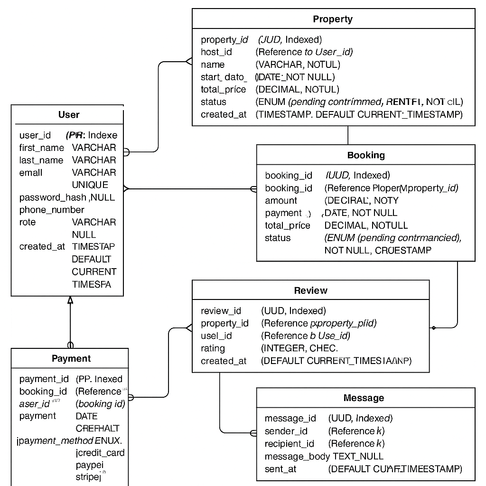

The ER diagram includes the following entities and relationships:

Entities:
User

Attributes: user_id (PK), first_name, last_name, email (unique), password_hash, phone_number, role (ENUM: guest, host, admin), created_at

Property

Attributes: property_id (PK), host_id (FK to User), name, description, location, pricepernight, created_at, updated_at

Booking

Attributes: booking_id (PK), property_id (FK to Property), user_id (FK to User), start_date, end_date, total_price, status (ENUM: pending, confirmed, canceled), created_at

Payment

Attributes: payment_id (PK), booking_id (FK to Booking), amount, payment_date, payment_method (ENUM: credit_card, paypal, stripe)

Review

Attributes: review_id (PK), property_id (FK to Property), user_id (FK to User), rating (1-5), comment, created_at

Message

Attributes: message_id (PK), sender_id (FK to User), recipient_id (FK to User), message_body, sent_at

Relationships:
A User can have multiple Properties (1:N)

A User can make multiple Bookings (1:N)

A Property can have multiple Bookings (1:N)

A Booking has one Payment (1:1)

A User can write multiple Reviews (1:N)

A Property can have multiple Reviews (1:N)

A User can send and receive multiple Messages (1:N as sender and recipient)
